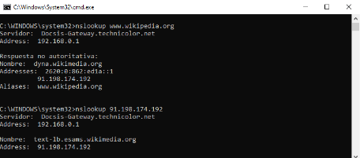

**EXERCICI 1.**  
Utilitzant la classe **InetAddress** i els mètodes que hem
vist, fes un programa que vaja demanant per l’entrada cadenes de
text fins que l’usuari escriga *“exit” o “quit”*. El programa acceptarà
com entrada noms de domini o adreces IP. Depenent de l’entrada,
s’haurà de fer la traducció de forma similar a com ho faria la
comanda **nslookup**. Si l’usuari ha escrit un nom de domini, el
programa retornarà l’adreça IP associada. Si l’usuari ha escrit una
adreça IP, el programa retornarà el nom de domini.  
